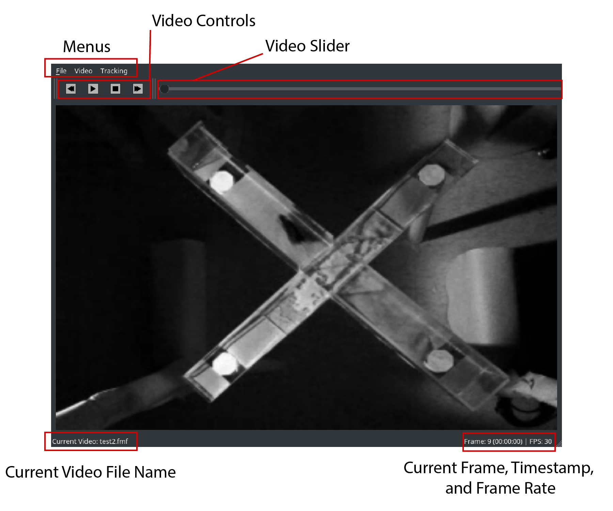

# intro

epm-tracker is a simple bit of software to track the position of a mouse in an elevated plus maze (though it could technically be used to track any dark object in almost any shape arena). It works by calculating a background image and subtracting this image off of every frame contained in a video file. Then, all pixels (1) below a user-defined threshold and (2) outside of a user-defined arena are removed from the image, and the remaining pixels are taken as objects of interest. The object of interest with the largest area is subsequently selected as the mouse, and its position is recorded.

# dependencies

This software uses [ffmpeg][1] to convert between different video formats. Specifically, if any video format other than a [FlyMovieFormat (.fmf)][2] is selected, then ffmpeg will convert the video file to a .fmf video and save this video in the same location as the selected file.

This software also uses [conda][3] for package and environment management. Though not absolutely required, the setup (described below) will assume that conda is installed.

# installation

- Note: I will describe how to install this software using the Anaconda Prompt, though any terminal should do.

First, download the epm-tracker .zip file and extract its contents to a memorable location (or clone this repository). Then, open an Anaconda Prompt (on Windows, search for Anaconda Prompt from the Start Menu), and navigate into the epm-tracker folder. Finally, use conda to setup an environment that will contain all of the necessary python packages needed to use this software. To do this, type the following into the Anaconda Prompt:

~~~bash
conda env create -f environment.yml
~~~

This will use the environment.yml file (located in the epm-tracker folder) to setup an environment called "epm". Once all of the required packages have finished downloading/installing, type the following into the Anaconda Prompt to activate the environment:

On Windows:

~~~bash
activate epm
~~~

On MacOS/Linux:

~~~bash
source activate epm
~~~

In parentheses, and to the left of the current directory within the Anaconda Prompt, you should see something like "(epm)", this means that you have successfully activated the epm environment.

The, install the epm-tracker package by typing the following into the Anaconda Prompt:

~~~bash
python setup.py install
~~~

This will run the installation script for the epm-tracker; you should now be able to import "epm" into any python program from within the current environment. To check that this is the case, run the following from the Prompt:

~~~bash
ipython
~~~

This will launch the Python [REPL][4], from which you can type:

~~~python
>>> import epm
>>> epm.__version__   # 0.1.1 should print to the prompt.
~~~

If everything proceeds without error, congratulations, you have successfully installed all of the necessary packages to start tracking your mice!

# launching the gui

With the epm environment activated, you should be able to launch the GUI by typing the following into the Anaconda Prompt (note that you can be in any directory, it doesn't matter if you are in the epm-tracker folder anymore):

~~~bash
epm-tracker
~~~

The GUI should launch without any issues.

# using the gui

## opening a video file

The main window is used as a media viewer (See Figure \ref{fig01}). To open a video, go to File -> Open, then select the video file you want to view/track. Currently, you are allowed to select a video file with any of the following formats: **.fmf**, **.avi**, **.mp4**, **.mov**, and **.wmv**. If you select any file type other than a .fmf file, ffmpeg will launch within the Anaconda Prompt and convert the selected video to a .fmf video. You can monitor the progress of this conversion by looking at the output within the Anaconda Prompt. Following successful conversion, the video will open in the media viewer. If you select a .fmf file, no video conversion will occur, and the video will automatically open in the media viewer.

## navigating through a video file

To navigate through the video file, you can use the video control buttons or slider located above the current frame in the video. By pressing the following hotkeys, you can navigate through the video just using your keyboard:

1. "spacebar" -> toggle play/pause
2. "]"        -> play
3. "["        -> pause
4. "."        -> next frame
5. ","        -> previous frame

## tracking a video file

To track a video file, ensure that a video is currently open and visible in the media viewer. Then go to Tracking -> Track Video. This should open the Tracking Dialog window. Within the Tracking Dialog window, there are currently three main things that need to be set: (1) the arena mask, (2) the pixel threshold, and (3) the number of frames used to calculate a background image.

### setting an arena mask

Within the first page of the Tracking Dialog window, you are asked to set an arena mask, which will be used to keep only those pixels (within each of the video frames) that fall within the EPM arena (See Figure \ref{fig02}).

The top three images in the "EPM Arena Mask" group box are as follows: (1) a raw image of the first frame of the selected video, (2) a binary image of the currently selected arena mask, and (3) an image of the arena mask placed on top of the raw image of the first frame of the selected video. Note that the white area in image (2) is retained, whereas the black area is discarded. Images (2) and (3) are initially black, and only show the specified arena when the user clicks the "Update Mask" button, described below.

The image just below the "EPM Arena Mask" group box is where the user specifies the arena. Use your mouse cursor to move each of the colored circles to one of the corners on the EPM. It shouldn't matter which dot is placed at which corner, though I haven't fully tested this yet. **Be careful to place the center of each dot within the image, placing them outside of the image will likely result in a bug that I haven't dealt with yet.** Once you are satisfied with the position of each of the colored circles, hit the "Update Mask" button. You should see that images (2) and (3) in the "EPM Arena Mask" group box are updated.

If you like the generated mask, you can proceed to the next page, or save the mask for later use, by hitting the "Save Mask" button. This will save the locations of each colored circle in two separate .xlsx files. The first file - saved with the name you've specified - contains the relative coordinates of the mask points. The second file - saved with the name you've specifed plus "-pixel-coords" appended - contains the raw pixel coordinates of the mask points. The first file is for use in loading masks onto the video being tracked. The second file is for use in [analyzing your tracking data](\ref{analysis}).

If you do not set a mask, all image pixels will be used to find the mouse in the EPM.

Use the ">>" button to proceed to the next page in the Tracking Dialog window.

### setting the pixel threshold

On the second page of the Tracking Dialog window, you will be asked to specify a threshold used to exclude pixels (See Figure \ref{fig03}). Any pixels below the currently set threshold will be discarded during tracking.

Similar to the first page of the Tracking Dialog window, there are three images at the top of the page, in a group box labeled "Images". (1) The first image is the calculated background image, (2) the second image is a raw image of the currently selected video frame, and (3) the third image is a background-subtracted and thresholded image of the currently selected video frame.

Using the "Tracking Settings" group box, the user can specify the tracking settings. Specifically, the spin box to the right of "Set threshold" can be changed, which will update the threshold to use for tracking. Following updating of the threshold, images (2) and (3) will also be updated to show you which pixels will be retained. The goal is to make the pixels representing the mouse as large as possible, while minimizing non-mouse pixels.

### setting the background image frame count

Just beneath the threshold spin box you can specify the number of frames to use in calculating the background image ("N frames to calculate background"). The background image is calculated by taking the mean image from N randomly selected frames contained in the video. The default value of 200 seems to work well in most situations.

### setting the save file

Use the "Browse" button to the right of the "Save name (.xlsx)" text edit to select a location to save the tracked file. If you forget to specify a save file, one will automatically be generated and saved for you in your home directory.

### validating your tracking settings

You can use the slider, spinbox, and "Random Frame" button in the "Jump to Frame" group box to navigate through each of the frames in the video being tracked. This is useful to make sure that your selected settings will work for the majority of the frames contained in the video. Note that if there are large fluctuations in lighting conditions (such as shadows appearing at certain points in the video), the selected settings for those frames will likely not work very well. Choose settings that work for the majority of the frames contained in the video to get the best results.

### tracking

Once you have specified all of the tracking settings, hit the "Begin Tracking" button to start tracking. The tracking progress is monitored via the progress bar on the bottom right side of the Tracking Dialog window. Once tracking has completed, the Tracking Dialog window will disappear, and the tracked video will be displayed in the media viewer.

## tracking files

All of the tracking data is saved into a .xlsx that contains the following columns: (1) frame, (2) rr, (3) cc, (4) area, (5) maj, (6) min. Each row represents the data from a single tracked frame, and any missing data is represented as a "NA" value.

During tracking, the mouse is identified as the largest blob of connected pixels. Subsequently, this "blob" is modeled as an ellipse, which can be defined by its centroid (center of mass), and major and minor axis lengths (orientation of the ellipse should also be included in this). The centroid position (x, y) is saved in pixel coordinates as (cc, rr), which are columns (3) and (2) in the .xlsx file. To plot the "true" position of the mouse in the video, you should plot cc versus -rr (this is because pixel coordinates of an image have an inverted y-axis relative to the normal Cartesian system). The major and minor axis lengths of the ellipse fitted to the blob are saved in columns (5) and (6), and the area of the ellipse fitted to the blob is saved in column (4).

Note that all of these values are currently in pixel units. Therefore, to compare between videos, you should ensure that you are not changing the camera's position or any of the camera's settings (such as zoom) between recordings.

# analyzing your data
 \label{analysis}

See the example Jupyter notebook, located in epm/docs for an example of how you could analyze some of your data.

To launch Jupyter notebook, open up a command prompt navigate to the folder containing your data, and type:

~~~bash
jupyter notebook
~~~

[1]: https://www.ffmpeg.org/
[2]: http://code.astraw.com/projects/motmot/fly-movie-format.html
[3]: https://www.anaconda.com/download
[4]: https://en.wikipedia.org/wiki/Read%E2%80%93eval%E2%80%93print_loop
